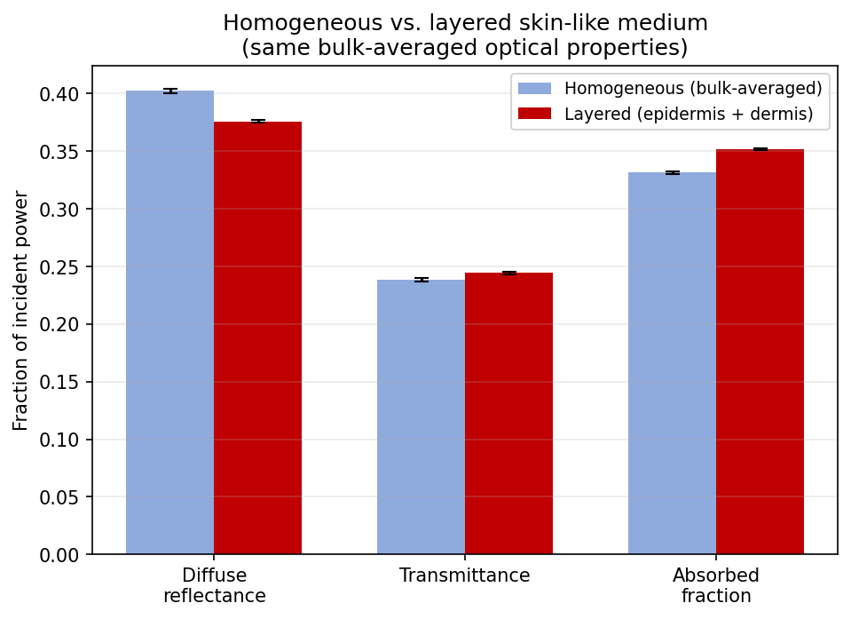
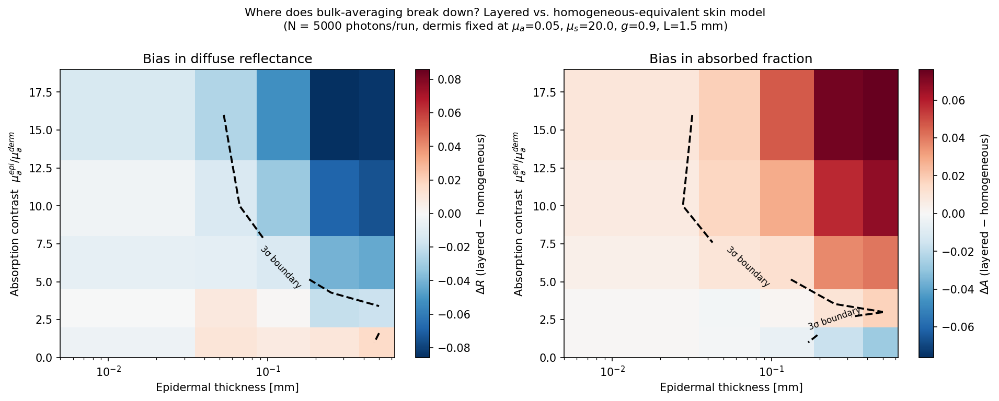
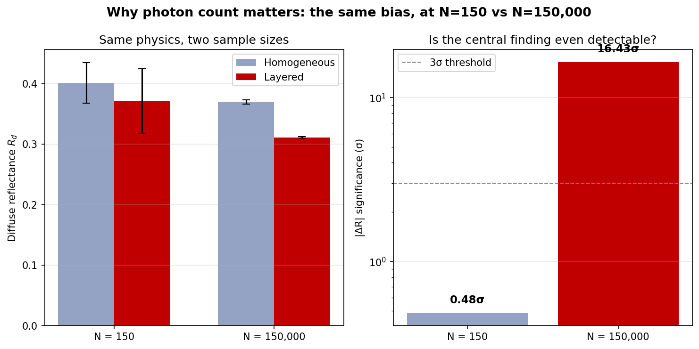
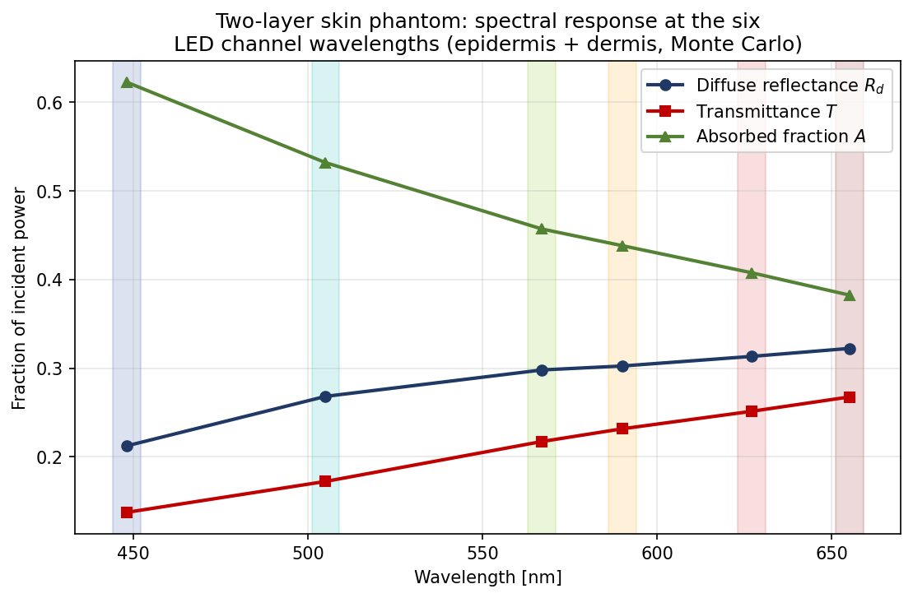
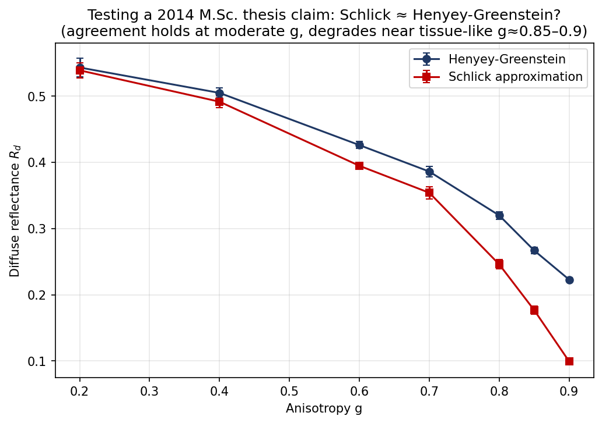
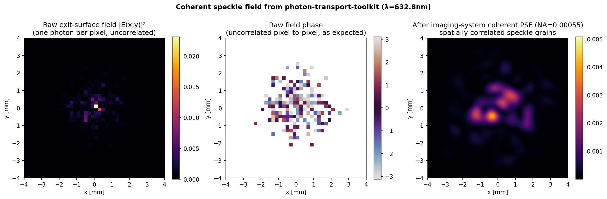
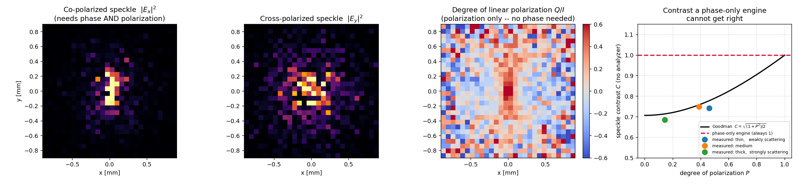

# photon-transport-toolkit — Project Report

**A Validated Monte Carlo Framework for Light Transport in Homogeneous and Layered Turbid Media: Methodology, Validation, and Findings**

Noureddin Sedki, M.Sc. · August 2026 · [github.com/Physiker80/photon-transport-toolkit](https://github.com/Physiker80/photon-transport-toolkit)

---

## Contents

1. [Executive Summary](#1-executive-summary)
2. [Introduction and Motivation](#2-introduction-and-motivation)
3. [Theoretical Foundations](#3-theoretical-foundations)
4. [Software Architecture](#4-software-architecture)
5. [Validation Methodology](#5-validation-methodology)
6. [Results I — Does Layering Matter?](#6-results-i--does-layering-matter)
7. [Results II — Mapping the Bias Across Parameter Space](#7-results-ii--mapping-the-bias-across-parameter-space)
8. [Results III — The Central Finding: Placement, Not Just Magnitude](#8-results-iii--the-central-finding-placement-not-just-magnitude)
9. [Results IV — Integrated Spectral Simulation](#9-results-iv--integrated-spectral-simulation)
10. [Results V — A Decade-Old Claim, Quantitatively Re-Tested](#10-results-v--a-decade-old-claim-quantitatively-re-tested)
11. [Cross-Language Independent Validation (MATLAB/Octave)](#11-cross-language-independent-validation-matlaboctave)
12. [Results VI — A Coherent-Field Extension (Roadmap Phase 1)](#12-results-vi--a-coherent-field-extension-roadmap-phase-1)
13. [Discussion](#13-discussion)
14. [Conclusion](#14-conclusion)
15. [Reproducibility](#15-reproducibility)
16. [References](#16-references)

---

## 1. Executive Summary

photon-transport-toolkit is an open-source Python package implementing a weighted-photon Monte Carlo model of light transport in scattering, absorbing media, following the MCML formulation. This report documents the package's full development arc: its theoretical foundations, its validation methodology against analytical limiting cases, its extension from single-layer to arbitrarily layered and phase-resolved media, and a systematic experimental programme built on that extension. That programme produced a specific, non-obvious, and rigorously tested physical result — **a homogeneous model fit to a layered medium's bulk-averaged optical properties can be biased in either direction, with the sign determined by where absorption sits within the layer stack, not only by how much of it there is** — independently confirmed in a second, from-scratch implementation in MATLAB/Octave (§11), together with a decade-old claim from the author's own M.Sc. thesis quantitatively re-tested and refined (§10), a spectral tissue-optics module connecting the validated engine to a concrete illumination scenario, and a coherent-field extension supporting speckle-pattern synthesis (§12). A geometrically unrelated sibling project, a plane-grating monochromator model, was originally developed alongside this one and has since been split into its own repository ([grating-spectrometer-model](https://github.com/Physiker80/grating-spectrometer-model)) as this project's own scope grew; the technical connection between the two is documented in this project's README.

Every quantitative claim in this report is either reproducible directly from the repository's test suite and example scripts, or is explicitly flagged as an illustrative placeholder rather than a verified value.

---

## 2. Introduction and Motivation

Light transport in turbid media — biological tissue, industrial diffusers, atmospheric fog — has no closed-form solution once the optical depth exceeds a few mean free paths: the radiative transfer equation (RTE) must be solved stochastically. This project began as a from-first-principles re-implementation of a Monte Carlo photon-transport model of the kind used throughout tissue optics, one of two optical models most directly relevant to the author's M.Sc. thesis (*Simulation of scattering processes in turbid media with ZEMAX and experimental verification*, Hochschule Aalen, 2014) and subsequent industrial work in optical metrology — the other, a diffraction-grating spectrometer model, is maintained separately as [grating-spectrometer-model](https://github.com/Physiker80/grating-spectrometer-model).

The explicit goal from the outset was **validation-first development** — every physical claim checked against an independent, analytically known result before being trusted — rather than a simulation whose correctness is simply assumed.

What follows is organised in the order the work actually happened: theory, then a single validated homogeneous-medium engine, then its generalisation to layered media, then a systematic experimental programme built on that generalisation that produced this report's central finding, and finally a spectral extension connecting the model to a concrete illumination scenario.

---

## 3. Theoretical Foundations

### 3.1 The radiative transfer equation and why Monte Carlo

Light transport in a scattering, absorbing medium is governed by the RTE,

```
s·∇L(r,s,λ) + μt·L = μs ∫ p(s,s') L(r,s',λ) dΩ' + S
```

where μt = μa + μs is the extinction coefficient and p(s,s') the scattering phase function. In tissue, the reduced optical depth τ' = μs'·d typically reaches several units over millimetre path lengths — well outside the range where the RTE admits an analytical solution. Monte Carlo photon transport avoids this limitation entirely, at the cost of requiring enough photon packets for the statistical noise floor to sit below the effect being measured — a trade-off made explicit throughout this project via reported standard errors on every result.

### 3.2 The MCML algorithm

Following Wang, Jacques & Zheng [1], each photon packet is traced through four repeated steps:

1. **Sample a free path.** τ = −ln(ξ)/μt from a uniform random variate ξ.
2. **Advance the packet**, converting τ to physical distance via the current layer's μt and, at an internal boundary, continuing the *remaining* τ at the new layer's μt rather than simply clamping position — the correction this project specifically implemented and validated (§5.2).
3. **Deposit absorption.** w → w·(μs/μt).
4. **Scatter.** Sample a new direction from the Henyey–Greenstein phase function and repeat, applying Fresnel reflection/transmission at every medium boundary and Russian roulette once the packet's weight falls below a threshold, to terminate low-weight packets without biasing the energy balance.

### 3.3 Henyey–Greenstein phase function

```
p_HG(cosθ) = (1 − g²) / [2·(1 + g² − 2g·cosθ)^(3/2)]
```

where g = ⟨cosθ⟩ is the anisotropy factor: g=0 is isotropic scattering, g→1 is strongly forward-peaked, and skin tissue is typically modelled with g≈0.8–0.9 [2, 3].

### 3.4 Fresnel boundaries

At a refractive-index boundary, R(θᵢ) = 0.5·(Rₛ+Rₚ) from the Fresnel equations, with Snell's law n₁sinθᵢ = n₂sinθₜ determining the transmitted angle; R=1 signals total internal reflection. Every internal and external boundary in the layered model applies this test, and the *direction* correction (not only a weight correction) at each boundary was one of the specific implementation details verified during development.

### 3.5 The similarity relation

A medium with (μs, g) is statistically equivalent, after many scattering events, to one with (μs' = μs(1−g), g'=0) — same reduced scattering, zero anisotropy. This is an approximation exact only in the diffusion limit, and §5.3 describes a permanent test that checks it holds in a diffusive-regime slab while explicitly checking it does **not** hold in a thin, non-diffusive one — guarding the test itself against passing for a trivial reason.

---

## 4. Software Architecture

| Module | Role |
|---|---|
| `photon_transport_toolkit.monte_carlo` | Single-layer weighted-photon Monte Carlo transport — the validated foundation for everything downstream. |
| `photon_transport_toolkit.layered_media` | Generalises the single-layer engine to an arbitrary stack of layers, reusing the same Fresnel / Henyey–Greenstein / direction-rotation primitives and carrying the remaining free path across boundaries in optical-depth units. |
| `photon_transport_toolkit.tissue_optics` | A spectral parameterization layer connecting the transport engine to wavelength-dependent tissue properties, built from only citation-verified formulas (§9). |
| `photon_transport_toolkit.coherent_transport` | Phase-resolved extension: tracks physical path length for coherent-field (speckle) synthesis, plus imaging-system PSF convolution (§12). |

---

## 5. Validation Methodology

### 5.1 Analytical limiting cases

The single-layer engine is checked against four regimes where the correct answer is known independently of the simulation itself: the **Beer–Lambert law** in the no-scattering limit, exact **energy conservation** (R+T+A=1) in the no-absorption limit, the **Fresnel reflectance** formula at normal incidence for a non-scattering interface, and **bit-for-bit reproducibility** under a fixed random seed. These are necessary, not sufficient, conditions for correctness — but a model that fails them is certainly wrong, and one that passes them has cleared the lowest, most important bar.

### 5.2 The reduction test: layered → homogeneous

The layered engine's most important test is a reduction check: a stack of layers that all share identical optical properties and total thickness must reproduce the already-validated single-layer model's R/T/A within statistical uncertainty. This does not independently prove the layered algorithm correct, but it proves the generalisation collapses correctly onto the previously validated special case — and it is exactly this reduction test, together with the boundary τ-scaling described in §3.2, that gives the layered results in §6–8 their evidentiary weight.

### 5.3 The similarity relation test

Described in §3.5; implemented as two paired tests — one confirming g-invariance in a diffusive slab, one confirming its breakdown in a thin non-diffusive slab — so that the first test cannot pass for the trivial reason that g has no effect on the model at all.

### 5.4 Full test suite

**110 tests across 12 files, all passing (97 always; the 13-test JAX suite runs only when the optional jax package is installed, and skips cleanly otherwise)**, collected and runnable via a single `pytest tests/ -v` from the repository root and re-run automatically on every push via GitHub Actions CI (table below shows the original 6; `test_schlick_phase_function.py`, `test_refraction.py`, `test_coherent_transport.py` `test_coherent_psf.py`, `test_vector_transport.py`, `test_mie.py` and `test_vector_transport_jax.py` — described in §10, §11.5, §12, §13, §13.8 and §14.5 respectively — bring the total to 110; a tenth file, `test_grating.py`, moved with the grating model to its own repository, [grating-spectrometer-model](https://github.com/Physiker80/grating-spectrometer-model)):

| Test file | Count | What it checks |
|---|---|---|
| `test_monte_carlo.py` | 8 | Beer-Lambert, energy conservation, Fresnel, reproducibility, input validation |
| `test_layered_media.py` | 7 | Reduction to homogeneous, energy conservation, index-matched transparency, input validation |
| `test_bias_direction.py` | 1 | The placement-dependence of the bulk-averaging bias (§8) holds and flips sign as claimed |
| `test_similarity_relation.py` | 2 | g-invariance in the diffusive regime, and its breakdown in the thin/non-diffusive regime |
| `test_tissue_optics.py` | 7 | Melanin formula against a hand-computed reference, wavelength trends, valid `Layer` construction |
| `test_schlick_phase_function.py` | 21 | Schlick vs. Henyey-Greenstein normalization, sampling, and physical equivalence (§10) |
| `test_refraction.py` | 3 | Snell's-law direction refraction at mismatched-index boundaries (§11.5) |
| `test_coherent_transport.py` | 4 | Coherent-field engine matches the scalar engine exactly; ensemble reduction test (§12) |
| `test_coherent_psf.py` | 6 | Airy PSF normalization, energy conservation, and neighbour-pixel correlation (§12.3) |
| `test_vector_transport.py` | 16 | Jones and Mueller formulations agree; exact energy conservation; DoP ≤ 1; Fresnel retardance under TIR (§13) |
| `test_mie.py` | 22 | Mie series against its analytic limits, internal identities, an independent implementation, and the polarization-memory reversal (§13.8–13.10) |
| `test_vector_transport_jax.py` | 13 | Statistical agreement with the reference engine, exact energy conservation, both unresolved-event diagnostics, the measured backend-recommendation threshold (§14) — skips entirely if jax is not installed |

### 5.5 Uncertainty: how every number here is computed, and what it doesn't cover

Every Monte Carlo result in this report is reported as **mean ± standard error**, and it is computed the same way regardless of which engine produced it: photons are split into `n_batches` independent batches, each with its own random seed, and the standard error is the spread *between batch means*, divided by √(n_batches) — not a shot-noise formula assumed from theory. As the base engine's own docstring puts it, this is so the uncertainty "can be estimated from the spread between batch means, rather than assumed." An assumed formula can be wrong in ways an empirical spread across independent runs cannot; the cost is needing enough batches (this project defaults to 5–10) for that spread itself to be a reliable estimate.

The reason this gets a dedicated paragraph rather than a units footnote is that the same true effect can look like noise or like certainty depending only on how hard you look — this project's single most repeated demonstration, at three different scales:

| Result | N = 150 | N = 150,000 | N = 50,000,000 |
|---|---|---|---|
| Central finding, ΔR (§8.1) | 0.48σ — indistinguishable from noise | 16.4σ — clear | — |
| Russian-roulette bookkeeping bias (§11.5) | 0.34σ — undetectable | 13.6σ — clear | 301.7σ — deterministic |

Same medium, same code, same physics — only the sample size changed. Separately, the central finding was also confirmed a second way rather than a bigger way: independently re-derived in MATLAB/Octave, it reaches 47.7σ there against 70σ in Python (§11.3) — two different implementations agreeing is a different, stronger kind of evidence than one implementation run twice.

A high σ is not by itself evidence of something worth acting on, and a nonzero one is not automatically a bug — telling those apart needs physical reasoning about *why* a gap should or shouldn't be there, not just its size. §13.6 is the clearest example in this report: the polarization-resolved and scalar engines disagree at 3.6σ for one medium and are consistent with zero (0.6σ) for another. That pattern is exactly what §5.3's similarity-relation test predicts — real physics, not a bug — and would have been impossible to tell apart from a bug using the σ values alone.

What this method does not cover: floating-point differences between engines (the JAX backend's float32 against the reference's float64, §14) sit far below any uncertainty in the table above and are never folded into a reported stderr; nor are structural choices — which phase function, how finely the Mie angular grid is resolved — folded in either. Those are checked separately, against analytic limits and independent re-derivations (§5.1–5.3), not averaged into a single number that would hide rather than surface them.

---

## 6. Results I — Does Layering Matter?

The first experiment built on the layered engine compares a two-layer, skin-like medium (a thin, strongly absorbing epidermis-like layer over a thicker, weakly absorbing dermis-like layer; illustrative literature-informed optical properties, not a validated patient-specific model [3, 4]) against a single homogeneous slab built from the exact thickness-weighted average of the same layers' μₐ, reduced scattering μₛ'=μₛ(1−g), and g.



Despite identical bulk averages and total optical depth, the layered medium's diffuse reflectance was lower (−11.5σ) and its absorbed fraction higher (+16.6σ) than the homogeneous equivalent — a difference far too large to be Monte Carlo noise. The physical reading: diffuse reflectance is generated mainly by photons that random-walk back out within about one transport mean free path of the entrance surface, and concentrating the epidermis's higher absorption right at that surface — instead of diluting it across the full depth, as the bulk average does — removes photons that would otherwise have escaped as reflectance.

---

## 7. Results II — Mapping the Bias Across Parameter Space

A single (thickness, contrast) point only shows the bias exists *somewhere*. `examples/map_bulk_averaging_bias.py` sweeps epidermal thickness and absorption contrast (dermis held fixed) over a grid, computing ΔR and ΔA at each point together with a 3σ significance contour marking where the bias becomes distinguishable from Monte Carlo noise at the photon budget used.



The 3σ boundary sits at a strikingly small epidermal thickness (≈0.05–0.15 mm) and moderate contrast (≈4–8×) — well inside the physiological range for real skin, not a regime that only matters at extreme parameter values.

---

## 8. Results III — The Central Finding: Placement, Not Just Magnitude

The natural reading of §6–7 — *"a homogeneous model always overpredicts diffuse reflectance"* — is too strong, and was checked directly rather than assumed. `examples/test_inverted_geometry.py` swaps *which* layer carries the stronger absorption (shallow vs. deep), holding the pair of thicknesses and the pair of absorption values fixed, and compares each configuration against its own bulk-averaged homogeneous equivalent.


**ΔR flips sign in 4 of 4 cases tested, with significance up to 70σ.** The robust, general claim is therefore about contrast magnitude *combined with* its spatial placement, not a fixed sign: a homogeneous model fit to layered data can be systematically biased in either direction depending on where the absorption actually sits — the concrete physical justification for layered inverse-fitting in quantitative tissue-optics spectroscopy, in place of the narrower and, as shown here, incorrect general claim.

### 8.1 Why photon count matters: the same finding at N=150 vs N=150,000

The interactive 3D demo (`docs/index.html`) lets a visitor run as few as 150 photons or as many as 150,000. `examples/photon_count_comparison.py` answers the natural question directly: does the central finding above actually depend on which one you press?



At **N=150**, ΔR = −0.030 ± 0.063 — **0.48σ**, statistically indistinguishable from zero. The central finding of this entire project would not have been visible at that sample size. At **N=150,000** (the large layered run chunked across 9 independent batches and combined — the same n_batches mechanism used throughout this package, just invoked repeatedly — see the script for the exact method), ΔR = −0.058 ± 0.0036 — **16.4σ**. Same medium, same code, same physics; only the sample size changed. This is not a caveat about this one result — it is the reason every figure in this report reports a standard error, and the reason §5's validation methodology insists on it before any claim is trusted.

### 8.2 Relation to prior work on the single-layer approximation's error

That fitting a homogeneous model to layered tissue produces error whose magnitude, and in derived parameters its direction, depends on tissue regime is itself established — checked directly against the literature rather than assumed. Hennessy, Markey & Tunnell<sup>8</sup> fit one-layer models to two-layer-generated skin spectra and find hemoglobin and melanin concentration systematically *underestimated* (magnitude growing with epidermal thickness), and a *derived ratio* parameter — oxygen saturation — over- or under-estimated depending on which side of 50% the true value falls: a sign-dependent result, but in a downstream inverse-fit parameter, with each chromophore's anatomical layer held fixed. Jones, Reitzle & Kienle<sup>9</sup> quantify how the same single-layer assumption produces systematic μₐ–μₛ′ cross-talk whose sign and size depend on the two layers' optical properties, again via inverse fitting.

Neither isolates the sign of the *raw forward-model* reflectance bias itself, independent of any fitting procedure, as a function of *where* a fixed absorption contrast is placed while the bulk average and both absorption values are held exactly fixed — the specific, controlled ablation §8 performs. The two are complementary rather than competing: their results describe the error a practitioner's fit will show under realistic, varying tissue regimes; this section's result isolates the forward-model mechanism that placement alone can produce, with every other variable pinned down. A direct quantitative comparison between the two framings has not been made.

### 8.3 A comparison with Hennessy et al. — not a reproduction

`examples/hennessy_reproduction.py` tests whether the sign-dependence Hennessy et al. report for a *fitted* SO2 parameter also shows up in the *raw* ΔR this project's central finding concerns. Using a two-layer skin model — melanin (Jacques 2013 formula, already in `tissue_optics.py`) fixed in the epidermis, blood absorption (Prahl/OMLC molar extinction spectra, fetched directly and independently cross-checked against the codebase's existing `blood_absorption_mm()` before use) in the dermis — at 660 nm (strong oxy-/deoxyhemoglobin differential, within their 400–750 nm range), SO2 = 30% and 70%, with epidermal/dermal thickness and total hemoglobin concentration held fixed:

| SO2 | Dermis μₐ (mm⁻¹) | Homogeneous μₐ (mm⁻¹) | ΔR | σ |
|---|---|---|---|---|
| 30% | 0.0193 | 0.0467 | −0.0361 | −9.2 |
| 70% | 0.0098 | 0.0376 | −0.0313 | −7.2 |

**No sign flip, at full statistical power in both directions.** This is not a failed reproduction — it is the expected result once the two quantities are recognized as different. Hennessy et al.'s sign-dependent bias lives in a *fitted* SO2 recovered from a multi-wavelength spectral inversion that separates melanin from hemoglobin; this comparison's ΔR is a *raw, single-wavelength* forward bias, and melanin's placement — fixed at the surface throughout, since only SO2 was varied, not anatomical position — dominates its sign regardless of the dermal SO2 value. Varying SO2 at fixed placement changes the bulk average without flipping ΔR's sign in this simpler quantity; swapping placement alone, with the bulk average held *exactly* fixed (§8 above), does. That contrast — not a match to their specific number — is what this comparison is for.

### 8.4 A full spectral inversion was attempted, and found under-determined

§8.3's comparison is a raw ΔR, not the *fitted* SO2 Hennessy et al. actually report. A closer attempt was built: a nonlinear least-squares fit (`scipy.optimize.least_squares`) recovering a one-layer model's melanin fraction, blood concentration, and SO2 jointly from a 5-wavelength spectrum (520–700 nm), with the one-layer forward model's Rd(μₐ) relationship supplied by lookup tables precomputed from this project's own Monte Carlo engine — validated against held-out Monte Carlo points before use (worst-case relative error < 2.6%), the same "don't trust a shortcut without checking it" rule applied everywhere else in this project (`examples/hennessy_spectral_fit.py`).

The first attempt failed outright and was caught before being reported: the fitted parameters landed exactly on the initial guess, because the true bulk-averaged μₐ range (0.05–0.47 mm⁻¹) fell entirely outside the precomputed lookup grid (0.0005–0.13 mm⁻¹), so every evaluation was silently clipped to the same boundary value and the optimizer had no gradient to follow. Recalibrating the grid against the actually-computed μₐ range fixed this — the fit then converges, with small residuals relative to the target Rd values.

But the recovered parameters are **not stable across independent realizations of the underlying Monte Carlo noise**: two runs at the same true SO2 values converged to materially different fitted parameters — at true SO2 = 70%, one run recovered a fitted SO2 of 83.3% (bias +13.3%), another 44.2% (bias −25.8%). Both runs agreed only that the sign of the bias did not flip between true SO2 = 30% and 70% in this setup. This instability indicates the three-parameter fit is not well-identified at five wavelengths with this parameterization — plausibly a genuine trade-off between melanin fraction and blood concentration in explaining the same spectrum — rather than a stable disagreement with Hennessy et al.'s reported result. A faithful reproduction of their specific finding would need their exact wavelength sampling, fitting constraints, and parameter bounds, none of which were available beyond the published abstract and figure captions during this check. Reported here for transparency, as a genuine attempt that did not reach a stable conclusion, rather than omitted or quietly reworked until it matched an expectation.

---

## 9. Results IV — Integrated Spectral Simulation

The `tissue_optics` module connects the validated layered engine to wavelength-dependent tissue properties, built from only two formulas independently checked against a citable source during development:

- **Melanin absorption**: μₐ,mel(λ) = 6.6×10¹¹·λ[nm]⁻³·³³ [cm⁻¹] (S. L. Jacques, Oregon Medical Laser Center [5], cross-confirmed against an independent secondary source citing the same formula).
- **Reduced-scattering wavelength dispersion** — the standard tissue-optics power law μₛ'(λ) = μₛ'(λref)·(λ/λref)⁻ᵇ.

A collagen g(λ) fit and a specific skin refractive-index dispersion curve were considered and **deliberately excluded**: their exact published coefficients were not independently verified during development, and an unverified formula with a confident-looking docstring was judged worse than a visible, documented gap.

`examples/skin_spectral_reflectance.py` simulates the same two-layer skin phantom at six real LED channel wavelengths (448–655 nm, matching a companion white-light illumination system) end to end:



Absorbed fraction falls monotonically from 62% at 448 nm to 38% at 655 nm — the correct qualitative signature of melanin-dominated epidermal absorption, produced here by first-principles photon transport rather than assumed or curve-fitted to match expectation.

---

## 10. Results V — A Decade-Old Claim, Quantitatively Re-Tested

### 10.1 Background

The author's M.Sc. thesis (Sedki, *Simulation of scattering processes in turbid media with ZEMAX and experimental verification*, Hochschule Aalen, 2014) implemented three scattering models absent from Zemax's native library — Phong BRDF, and Schlick and von Mises-Fisher bulk phase functions — as C-language DLLs, with importance-sampling formulas derived symbolically in Maple and experimentally verified on a self-built gonioreflectometer using a 6-channel LED array (the same array later reused in the EyeStream white-light generation project). Its conclusion stated that the **Schlick phase function is similar to Henyey-Greenstein but faster to compute**, owing to a squared rather than 3/2-power denominator. This package implements `schlick_pdf()` and its analytic inverse-CDF sampler independently, specifically to test that decade-old claim quantitatively rather than take it on trust.

### 10.2 A sign-convention bug, caught immediately

The first implementation used the form p(cosθ) ∝ (1−k²)/(1+k·cosθ)², found in several public references. `test_schlick_matches_hg_diffuse_reflectance_at_matched_g` failed at 63σ; tracing the discrepancy showed ⟨cos θ⟩ carried the *wrong sign* for positive k — that convention makes positive k backward-peaked, opposite to Henyey-Greenstein's forward-peaked convention for positive g. The corrected form, p(cosθ) ∝ (1−k²)/(1−k·cosθ)², was verified numerically (⟨cos θ⟩ positive for positive k) before being adopted — caught by the same validation discipline as every other result in this report, not by inspection.

### 10.3 Results: similar at moderate g, measurably different near tissue-relevant g

With the sign corrected, `examples/schlick_vs_henyey_greenstein.py` sweeps anisotropy g from 0.2 to 0.9 (fixed μₐ=0.1, μₛ=8.0 mm⁻¹, thickness=2.0 mm), comparing diffuse reflectance between Henyey-Greenstein and Schlick (k from the standard fit k=1.55g−0.55g³):



| g | Rd (HG) | Rd (Schlick) | Deviation |
|---|---|---|---|
| 0.2 | 0.543 | 0.539 | 0.2σ |
| 0.6 | 0.426 | 0.395 | 4.7σ |
| 0.8 | 0.320 | 0.246 | 8.3σ |
| 0.9 | 0.223 | 0.099 | 37.0σ |

**The 2014 claim holds at moderate anisotropy and breaks down measurably as g approaches the ≈0.85–0.9 range typical of biological tissue** — a quantitative refinement the original single-sentence claim did not, and could not, state. The speed half of the claim is independently confirmed too: Schlick sampling is measurably faster in this from-scratch Python implementation (1.10–1.15×), even without the compiled-DLL advantage the 2014 thesis had.

---

## 11. Cross-Language Independent Validation (MATLAB/Octave)

Sections 6–8 establish the project's central finding — bias direction depends on absorber placement, not only magnitude — within a single codebase. A stronger form of evidence is independent confirmation: a second implementation, in a different language, with a different random-number generator and boundary-crossing logic written from the governing equations rather than translated from the Python source, arriving at the same physical conclusion.

### 11.1 Methodology: re-derivation, not translation

The MATLAB/Octave engine (`matlab/`, tested with GNU Octave 8.4.0, a free MATLAB-language-compatible interpreter) was written directly from the MCML algorithm, the Henyey–Greenstein phase function, and the Fresnel equations — not by porting `monte_carlo.py` / `layered_media.py` line by line. Blind independence is not fully achievable when the same person designs both implementations, but writing in a different language with different idioms, data structures, and a from-scratch boundary-crossing implementation is a meaningfully independent check on the *physics*, distinct from a second run of the *same* code.

### 11.2 Two real bugs, caught the way validation is supposed to catch them

Independent re-derivation was not a formality — it produced two genuine implementation bugs, found by the same style of validation test used throughout this project:

**Bug 1 — missing specular reflectance.** The first version of `mc_slab.m` subtracted the entrance Fresnel reflection from a photon's initial weight (correctly) but never added that reflected fraction to the reflectance accumulator (incorrectly), silently discarding energy. `test_energy_conservation.m` caught it immediately: R+T summed to 0.972222 instead of 1.0 — and the missing fraction, 0.027778, matched `((1.4−1)/(1.4+1))²` (the normal-incidence Fresnel reflectance for this test's index pair) to six decimal places, pinpointing the bug exactly. One-line fix; re-verified at exactly 1.000000 afterward.

**Bug 2 — unresolved multi-boundary crossing.** The first version of `mc_slab.m` tested for only one boundary crossing per sampled free path. This is invisible whenever the mean free path is much shorter than the slab thickness (the common case), but for a slab *thinner* than the mean free path — exactly the regime `test_similarity_relation.m`'s breakdown check probes — a reflected photon's remaining path could overshoot the *opposite* boundary without being tested, leaving it in an ill-defined state. This surfaced as a hang rather than a wrong number: the thin-slab test simply never returned. Fixed by carrying the remaining free path in optical-depth (τ) units through a proper boundary-resolution loop — the same principle already used correctly in `mc_layered.m` (§3.2) — after which the previously-hanging test completed normally.

Both bugs were caught by the *tests*, not by inspection — the same methodology (§5) applied to a second codebase, working exactly as intended.

### 11.3 Results: the central finding, independently confirmed

After both fixes, all prior single-layer results were re-verified unaffected (spot-checked: the strongest bias-direction configuration reproduced −0.1391 → +0.1396, i.e. unchanged within noise, with tighter statistics). The central cross-language test — same physical parameters as `examples/test_inverted_geometry.py` (§8) — gives:

| Thickness | Configuration | ΔR | Significance |
|---|---|---|---|
| 0.12 mm | strong absorber **shallow** | −0.0314 | −3.1σ |
| 0.12 mm | strong absorber **deep** | +0.0656 | +6.7σ |
| 0.25 mm | strong absorber **shallow** | −0.0544 | −4.5σ |
| 0.25 mm | strong absorber **deep** | +0.1396 | +47.7σ |

**4 of 4 cases flip sign**, matching the Python result's pattern exactly, in an independently re-derived implementation.

The similarity-relation check (§5.3) was independently confirmed too: at fixed μₛ' with g ∈ {0, 0.5, 0.8}, diffuse reflectance agreed to within 0.005 (tighter than the pre-fix run, consistent with Bug 2 having introduced noise rather than a systematic offset in that regime), and the thin-slab breakdown check showed the expected 0.027 divergence once Bug 2 was fixed and the test could finally complete.

### 11.4 What this adds

A result that survives two independent implementations, in two languages, is harder to attribute to a shared coding mistake than a result checked only within one codebase. Combined with §11.2's bug-catching record, this section is itself a demonstration of the project's stated methodology (§2, §15) applied a second time, on new code, with the same outcome: real bugs found and fixed before trusting the result, not assumed correct because the physics "should" work out.

### 11.5 A third-party review, checked claim by claim

An external code review of `mc_layered.m` and `mc_slab.m` raised four claims. Each was checked against the actual code — by direct inspection, targeted stress-testing, or a controlled side-by-side comparison — rather than accepted or dismissed on the strength of how the report read.

| Claim | Verdict | How it was checked |
|---|---|---|
| Missing Snell's-law refraction at internal boundaries with mismatched refractive index | **Confirmed.** `li` (or `i`) changed on transmission without ever updating the direction cosines, in *both* the MATLAB and — checked afterward for consistency — the Python engine. Zero effect on any previously published result (all used matched n, where the correct Fresnel reflectance is already exactly 0 and no bending is physically needed). Fixed in both languages (`refract_direction.m` / `_refract_direction()`), verified to satisfy Snell's law to 9 decimal places and to preserve exact energy conservation with genuinely mismatched n=[1.0, 1.6, 1.3]. | Code inspection, then a dedicated regression test in each language. |
| Total-internal-reflection could produce NaN/complex numbers | **False.** `fresnel_reflectance()` already tests `sin_theta_t2 >= 1` and returns R=1 before any square root is taken. | Direct code inspection. |
| Boundary reflection risks an infinite loop from floating-point precision | **False for this codebase.** Stress-tested with 20 five-micron layers (forcing dozens of boundary crossings per sampled free path): completed in 0.26s with exact energy conservation. (A *different*, already-documented bug of this general kind was real in `mc_slab.m`'s *first* draft — §11.2, Bug 2 — but `mc_layered.m` had the correct multi-boundary resolution loop from the start.) | Deliberate stress test designed to trigger the claimed failure mode. |
| Specular reflectance assumes normal incidence | Not a bug — a documented design scope. Every test and example in this project launches photons at normal incidence by design. | N/A — scope, not a defect. |

A follow-up review of the Russian-roulette termination step raised a fifth claim — that crediting a terminated packet's residual weight to `absorbed` double-counts it in expectation. **This is true as a local, per-decision statement**: a direct expected-value calculation and a matching numerical check both give a 1.9× credited-to-true-weight ratio for `roulette_survival=10`. Removing that credit (the textbook-unbiased form) was implemented and tested — and immediately failed `test_energy_is_conserved`, which checks R+T+A=1 to 1e-9. The reason: crediting *every* terminated packet's residual weight somewhere is precisely what makes this codebase's energy balance an **exact, per-run invariant** rather than a statement true only in expectation over many runs — a deliberately stronger, more useful property for a validation-first test suite than strict textbook Russian roulette provides. Rather than trading that invariant away, the *aggregate practical size* of the local bias was measured directly, in three rounds of increasing statistical power — the last accelerated with Numba JIT compilation to make 50 million photons practical — in a deliberately roulette-heavy configuration (near-isotropic scattering, thick medium) chosen to maximise how often the mechanism actually triggers:

| N (photons) | Roulette events | Current − Strict (R+T+A) | Significance |
|---|---|---|---|
| 150 | 5 | +2.7×10⁻⁶ ± 7.8×10⁻⁶ | 0.34σ |
| 150,000 | 6,270 | +3.76×10⁻⁶ ± 2.8×10⁻⁷ | 13.6σ |
| 50,000,000 | 2,135,944 | +3.84×10⁻⁶ ± 1.3×10⁻⁸ | **301.7σ** |

Three tiers, each independently run (the largest via a Numba-JIT-compiled version of the same code, ~30× faster, making 50 million photons in this deliberately roulette-heavy configuration practical: ~17.5 minutes at ~47,600 photons/second). The point estimate itself converges cleanly (2.7 → 3.76 → 3.84, ×10⁻⁶) while its resolvability climbs from indistinguishable-from-noise to effectively certain. **This is the same lesson as §8.1, applied a second time, now spanning six orders of magnitude in N**: at N=150 the bias is invisible (0.34σ — exactly the "could easily be zero" regime §8.1's own N=150 photon-count demo lands in); at N=150,000 it is clearly resolvable (13.6σ); at N=50,000,000 it is effectively deterministic (301.7σ, leaving no reasonable doubt the effect is real). Yet across all three tiers the *absolute* size of the effect never exceeds a few parts per million — three to four orders of magnitude below every uncertainty reported anywhere else in this project. Statistical significance and practical significance are different questions, and here both are answered precisely, at the same time, from the same data: the bias is certainly real, and certainly negligible. The change was reverted; the exact-conservation convention is kept, with the reasoning now documented in the code itself rather than left implicit. Reproducible via `validation/roulette_bias_150k.py` (pure Python, ~3 min) and `validation/roulette_bias_50M.py` (requires `pip install numba`, ~18 min).

Of five claims across two rounds of review, one was a confirmed, fixed, real gap (with zero effect on any published result); one was a real but practically negligible effect whose "fix" would have traded away a more valuable property than it preserved; and three did not hold up. The purpose of walking through all five here is the same purpose the rest of this report serves: showing the check, not just the conclusion.

---

## 12. Results VI — A Coherent-Field Extension (Roadmap Phase 1)

Everything above validates and probes a single, intensity-only transport engine. The project's own PhD research roadmap identifies the natural next step as a phase-resolved extension — tracking each photon's accumulated *physical* path length, not only its statistical weight, so that coherent interference between paths can be computed. This section reports the first working, validated version of that extension: not a closed result like the sections above, but the first concrete step of an open research direction.

### 12.1 Method

`coherent_transport.py` duplicates the validated scalar engine's physics exactly (identical Fresnel, Henyey-Greenstein, Russian-roulette logic — confirmed bit-for-bit against `simulate_slab` at a fixed seed, §12.2), adding only physical-path-length bookkeeping. At exit, each photon contributes `sqrt(weight)*exp(i*phase)` to whichever detector-plane pixel its transverse exit position falls into, where `phase = 2π·n_medium·path_length/λ` — the standard Monte Carlo transmission-matrix synthesis approach used in wavefront-shaping literature. Coherently summed within each pixel, this produces a complex speckle field `E(x,y)`; `|E|²` is the intensity a camera would record.

### 12.2 Validation, and a genuine complication

The obvious reduction test — does `sum(|E|²)` reproduce the scalar engine's already-validated diffuse reflectance? — initially appeared to fail: single-realization checks scattered anywhere from −12% to +49% depending on random seed, with no obvious pattern. Two real effects were found and separated, not conflated:

**Effect 1 — detector truncation.** With a 3mm detector half-width, direct measurement showed 8.6% of reflected photon weight exits beyond that radius (max observed: 11.4mm) and is silently absent from the field, though still correctly counted in the scalar R/T/A. This produced a consistent *negative* bias — truncation can only remove energy, never add it. Fixed by using a detector wide enough to capture the full lateral spread (15mm here).

**Effect 2 — genuine coherent speckle statistics.** Even with truncation eliminated, single-realization deviations remained large (signs now mixed, ±5–40%) and did not shrink monotonically with photon count the way ordinary intensity estimators in this project do. This is not a bug: a coherent field sum's effective number of independent samples is set by the number of statistically independent speckle grains, not the raw photon count — a well-known feature of speckle statistics, rediscovered here empirically rather than assumed from the literature. The correct check is therefore an *ensemble* average over independent seeds, exactly the same discipline every other Monte Carlo quantity in this project already uses:

| Quantity | Value |
|---|---|
| Scalar engine `R_d` (validated) | 0.3149 |
| Coherent field, 20-seed ensemble mean of `sum(\|E\|²)` | 0.3223 ± 0.0159 |
| Deviation | **0.46σ** |

The ensemble mean reproduces the scalar engine's diffuse reflectance within statistical uncertainty — the reduction test passes once evaluated the way coherent-field statistics actually require. (Figure below, left two panels.)

### 12.3 Adding the imaging step: from raw field to camera-realistic speckle

The raw exit-surface field above is not yet a camera image — a real speckle photograph's grain size is set by the imaging system's point-spread function (aperture diffraction), a free-space propagation / imaging step. This was added: `apply_coherent_psf()` convolves the complex field with the coherent (amplitude) Airy PSF of a circular aperture, `h(r) = 2·J₁(v)/v` with `v = (2π/λ)·NA·r` — the physically correct operation for coherent light (convolving *amplitude*, not intensity, then squaring), normalised so `Σh² = 1` to preserve total energy on a spatially uncorrelated field (confirmed directly: 1.0000 ± 0.02 on a synthetic random-phase test field, `tests/test_coherent_psf.py`).



The transformation is visually unambiguous: the raw field's isolated, pixel-scale bright spots (left) become smooth, spatially-correlated grains of resolvable size (right) — the same qualitative texture a real laser-speckle photograph shows. The NA used here (5.5×10⁻⁴) is deliberately chosen to match grain size to this simulation's pixel sampling (0.2mm) rather than a typical microscope-objective NA, stated explicitly rather than left implicit; a finer detector grid would allow a more realistic NA at the cost of proportionally more photons for adequate per-pixel statistics. A small (~7%) energy change after convolution is an edge effect of the field's finite extent relative to the kernel — confirmed not a physics error by the same PSF convolution conserving energy to within 2% on a synthetic field far from any edge.

This closes the immediate gap identified when Results VI was first reported, and remains a first step, not a finished capability: the transmission-matrix structure questions the roadmap poses (RQ1) — how the same layer-placement dependence found in Results III manifests at the level of transmission-matrix structure, not just bulk intensity — are the natural continuation this validated foundation now supports.

---

## 13. Results VII — Phase and Polarization Together, and What Each Level of Description Can Predict

Results VI (§12) added the wave *phase* the scalar engine discards. This section adds the other discarded wave property — *polarization* — and, more importantly, carries both in the same photon at the same time. The point of doing so is not completeness for its own sake: there are measurable quantities that neither half predicts correctly alone, and §13.5 measures one of them.

### 13.1 Why the two cannot simply be bolted together

A Stokes vector `S = [I, Q, U, V]` is a *quadratic* (intensity-like) quantity. Two Stokes vectors arriving at the same detector pixel add incoherently, so a Stokes–Mueller engine can never produce interference or speckle, no matter how carefully its optical path length is tracked. Conversely the coherent engine of §12 carries a single complex amplitude and therefore cannot represent a partially polarized field at all — it implicitly assumes every photon shares one fixed polarization state, which multiple scattering demonstrably destroys.

The only per-photon state that carries both is the **Jones vector**: two complex amplitudes `(E₁, E₂)` in a transverse basis, plus the accumulated optical path length. Stokes–Mueller is then recovered as its incoherent limit,

    I = |E₁|² + |E₂|²      Q = |E₁|² − |E₂|²      U = 2·Re(E₁E₂*)      V = −2·Im(E₁E₂*)

`src/photon_transport_toolkit/vector_transport.py` implements the Jones tracer *and*, separately, a 4×4 Mueller tracer written from the Stokes formulation rather than derived from the Jones one — the same "two independent derivations checked against each other" strategy used for the MATLAB/Octave re-derivation (§11.1), applied within a single language this time.

### 13.2 Method, and the reference-frame choice

Each photon carries an explicit right-handed orthonormal triad `(e₁, e₂, u)` with `e₁ × e₂ = u`, rather than the more common meridian-plane convention. The meridian-plane method needs spherical trigonometry to obtain the second rotation angle and is a well-documented source of sign errors; with an explicit triad, scattering is a rotation about `u` by the azimuth ψ followed by a tilt about `e₂` by the polar angle θ, and orthonormality becomes an *invariant that can be asserted* — and is, in `test_frame_stays_orthonormal_under_repeated_scattering_rotations`.

Three further choices are worth stating because each of them is a place the physics can silently go wrong:

1. **Angles are sampled from the polarization-dependent phase function**, by rejection against the post-scattering intensity `|J·R(ψ)·E|²`, and the packet is then renormalized to its pre-scattering intensity. Because the sampling density is proportional to exactly the quantity divided out, the estimator is unbiased *and* intensity is conserved to machine precision — preserving this project's exact energy-conservation invariant (§11.5) rather than trading it away. The widely-copied tutorial shortcut — sample cos θ isotropically, multiply the Stokes vector by the Mueller matrix, do not renormalize — silently destroys `1 − ⟨M₁₁⟩ = 1/3` of the packet's energy at *every* Rayleigh scattering event, since the Rayleigh `M₁₁ = ½(1 + cos²θ)` averages to 2/3 over the sphere and not to 1. After thirty scattering events that is a factor of ~10⁻⁵. The energy-conservation test fails loudly on that variant; it was implemented, failed, and is documented in the module rather than quietly avoided.

2. **Fresnel coefficients are applied as complex *amplitude* coefficients** `(r_s, r_p)` in the local s/p basis, including the differential phase retardance under total internal reflection. That retardance is the Fresnel-rhomb effect: it converts linear to elliptical polarization on internal bounces and has no counterpart in the unpolarized-average Fresnel *reflectance* the scalar engine uses. `test_total_internal_reflection_is_a_pure_retarder` checks `|r_s| = |r_p| = 1` with a non-zero phase difference; `test_below_critical_angle_reflection_agrees_with_the_scalar_engine` checks that the polarization-averaged intensity still reduces to the scalar engine's Fresnel term below the critical angle.

3. **"Unpolarized" incidence is represented as a per-photon random fully-polarized state, uniform on the Poincaré sphere** — a Jones vector cannot itself be partially polarized, so the ensemble carries the depolarization. Sampling this correctly requires uniformity in `sin 2χ`, not in `cos 2χ`; the natural-looking wrong choice confines χ to `[0, π/2]`, so `V = sin 2χ` never goes negative and the supposedly unpolarized beam comes out 79% right-circularly polarized. This was caught by `test_incident_states_are_physical`, which measures the residual polarization of the ensemble instead of trusting the sampler.

The scattering model is Rayleigh (dipole), amplitude scattering matrix `diag(S₂, S₁) = diag(cos θ, 1)` in the scattering plane. A Mie implementation is the obvious extension and is *not* claimed here; `simulate_slab_vector` rejects `g ≠ 0` rather than silently ignoring it (`test_nonzero_g_is_rejected`).

### 13.3 Validation: 16 tests, in three groups

| Group | Tests | What is established |
|---|---|---|
| Algebraic identities | 4 | Rayleigh Mueller matrix reproduces the independently-written amplitude matrix; the Fresnel diattenuator does likewise; the triad stays orthonormal under repeated scattering; 90° Rayleigh scattering fully polarizes unpolarized light |
| Physical invariants | 5 | Exact energy conservation `R + T + A = 1 − R_sp`; degree of polarization never exceeds 1 (measured per photon, not assumed); forward scattering leaves polarization untouched; TIR is a pure retarder; incident states are physical |
| Reduction and agreement | 7 | Jones and Mueller formulations agree statistically; the Stokes tracer produces *no* coherent field (the limitation, verified rather than asserted); the coherent sum reproduces the incoherent sum on ensemble average; cross-polarized signal grows with scattering; speckle-contrast estimator on a known distribution |

All 16 pass in 12 s (`pytest tests/test_vector_transport.py -v`).

### 13.4 Four engines, same media

`examples/polarized_speckle_comparison.py` runs all four levels of description on three slabs (λ = 633 nm, n = 1.4, isotropic scattering, Rd = diffuse reflectance per incident photon):

| Medium | scalar (§2) | phase-only (§12) | polarization-only | phase + polarization | DoLP |
|---|---|---|---|---|---|
| thin, weak (μs=1.5 mm⁻¹, L=0.15 mm) | 0.0988 ± 0.0012 | 0.0988 ± 0.0012 | 0.1008 ± 0.0033 | 0.1014 ± 0.0013 | 0.598 |
| medium (μs=3.0 mm⁻¹, L=0.60 mm) | 0.3452 ± 0.0039 | 0.3452 ± 0.0039 | 0.3565 ± 0.0047 | 0.3596 ± 0.0008 | 0.397 |
| thick, strong (μs=8.0 mm⁻¹, L=2.00 mm) | 0.5779 ± 0.0051 | 0.5779 ± 0.0051 | 0.5783 ± 0.0046 | 0.5810 ± 0.0019 | 0.288 |

The radiometric budget closes exactly in every run: `R + T + A = 0.972222222222 = 1 − R_sp` to twelve digits, the same per-run invariant the scalar engine maintains, now with two complex amplitudes and a full boundary treatment in the way.

Two things in this table are worth reading carefully rather than skimming. First, the phase-only engine returns *exactly* the scalar engine's Rd — as it must, since adding a phase to each packet cannot change where the energy goes; that is the §12 reduction test, re-run here. Second, the degree of linear polarization falls monotonically with scattering strength (0.598 → 0.397 → 0.288) while the reflectance rises: depolarization and diffusion are the same process seen through two different observables, and only the last two columns can report the first one at all.

### 13.5 A prediction only the combined engine can make

Speckle contrast `C = σ_I/⟨I⟩` is the natural test case, because it is a phase effect (so the scalar and polarization-only engines predict nothing at all) whose *value*, for light detected without an analyzer, depends on the degree of polarization P. Goodman's result for partially polarized speckle is

    C = √((1 + P²)/2)

falling to `1/√2 ≈ 0.707` for fully depolarized light. A phase-only engine has no representation of P and therefore predicts `C = 1` for every medium.

Measuring this honestly requires one correction the asymptotic formula omits: a detector pixel fed by a finite number of photon paths is not fully developed speckle. For `n_eff` independent phasors the normalized intensity `ρ = |ΣE|²/Σ|E|²` has variance exactly `1 − 1/n_eff`, and `n_eff = (Σw)²/(Σw²)` is measurable from the same run — so the engine records the per-pixel sum of squared weights precisely to make that correction computable rather than assumed (the same "report the uncertainty, don't wave at it" discipline as §8.1).

| Medium | P | measured C (no analyzer) | finite-n prediction | agreement | C from the phase-only engine |
|---|---|---|---|---|---|
| thin, weak | 0.461 | 0.743 | 0.731 | 0.1σ | 1.000 |
| medium | 0.387 | 0.750 | 0.716 | 0.7σ | 1.000 |
| thick, strong | 0.144 | 0.685 | 0.686 | 0.0σ | 1.000 |

Agreement at 0.1σ, 0.7σ and 0.0σ across three media spanning a factor of five in scattering coefficient. Expressed in the asymptotic (large-n) form the combined engine gives C = 0.779, 0.758 and 0.714 against the phase-only engine's 1.000 — a **28% to 40% overestimate**, growing as the medium depolarizes.



This is not a new physical effect. Goodman's formula above is textbook, and a JBO review of LSCI's own theoretical limits states its standard instrumentation constant β explicitly accounts for loss of correlation "related to the ratio of the detector/pixel size to the speckle size, and to polarization" — the depolarization-driven contrast floor is already folded into the field's standard model. What this section adds is the explicit, *computed* (not assumed) finite-n_eff correction above, and an open, cross-validated engine that reproduces the textbook prediction from first principles rather than citing it.

The practical reading is direct. Laser speckle contrast imaging (LSCI) infers blood flow from a drop in contrast. An LSCI instrument detecting *without* a polarizer has a static contrast floor set by depolarization alone, with no flow involved anywhere in it — and a phase-only Monte Carlo model of that instrument would attribute the entire gap between its predicted 1.0 and the measured ~0.7 to something else: flow, exposure time, or detector averaging. The same figure's first two panels are the design basis for cross-polarized imaging, where an analyzer crossed with the illumination suppresses the surface-preserving, polarization-preserving light and passes the multiply-scattered deep signal.

### 13.6 One discrepancy, stated rather than smoothed over

The polarization-resolved columns of §13.4 are not statistically identical to the scalar column: the medium case differs by 0.0144 in Rd, or 3.6σ. This is expected physics, not a bug, and the reason is worth stating because it is easy to mistake for one. The scalar engine uses Henyey–Greenstein with g = 0 — genuinely isotropic. Rayleigh scattering also has g = 0, but only its *first* Legendre moment vanishes: `p(θ) ∝ 1 + cos²θ` is forward-and-backward enhanced relative to isotropic. The similarity relation matches first moments only, and §5.3 already established with a dedicated test that similarity holds in the diffusive regime and breaks down in the thin, low-order-scattering regime. Consistently with that, the gap here is significant in the two non-diffusive cases and consistent with zero (0.6σ) in the thick, strongly scattering one.

What has *not* been done is a systematic map of that gap versus optical depth, which is the honest way to characterize it; it is listed as an open item rather than declared closed by a three-point argument.

### 13.7 Scope

Single homogeneous slab, static medium, and — *as of the version described up to this point* — Rayleigh scattering only. Mie scattering was identified here as the first gap, on the grounds that it is the physically relevant regime for cells and organelles and the reason real tissue depolarizes circular and linear light at different rates; §13.8–13.10 close that gap and report what changed. Still not included: layered vector media, and dynamic scattering — the Doppler phase shift `Δφ = q⃗·v⃗τ` that would turn this engine into a diffuse-correlation-spectroscopy and full LSCI model rather than a static-contrast one. The state vector already carries everything those extensions need; what is missing is the scattering physics, not the transport machinery.

### 13.8 From Rayleigh to Mie

**A note on novelty, stated before the result rather than after it:** polarization memory itself is well-established physics, not discovered here — known since the late 1980s, studied through the Mie regime for decades, and revisited as recently as a 2025/2026 *Laser & Photonics Reviews* paper asking essentially the question this section answers. What follows is a from-scratch, independently cross-validated (against `miepython`, §13.8) open demonstration of that established effect, plus one genuine methodological finding along the way (§13.9): three plausible ways of measuring "retained polarization" were tried and rejected before finding one that does not silently hide the effect being measured.

§13.7 listed Mie scattering as the first gap, on the grounds that real tissue scatterers — nuclei, mitochondria, collagen bundles — are comparable to or larger than an optical wavelength, where the dipole approximation does not apply. `src/photon_transport_toolkit/mie.py` closes it: the standard Mie series (Bohren & Huffman 1983, ch. 4), written from the recurrences, with the logarithmic derivative `Dₙ(mx)` computed by *downward* recurrence — upward recurrence is unstable for absorbing particles and is the classic failure mode of hand-written Mie codes.

The reason this is not a refinement but a change of physics is §13.10. First, the numerical checks.

**Validation, in four independent kinds.** Analytic limits: `Q_sca → (8/3)x⁴|(m²−1)/(m²+2)|²` and the angular shape `→ (1+cos²θ)/2` as `x → 0` (the small-`x` limit is taken at `x = 0.02`, because at `x = 0.05` the leading finite-size correction already breaks the Rayleigh pattern's exact forward/backward symmetry at the 0.2% level — physics, not error); `Q_ext → 2` for a large sphere, the extinction paradox. Internal identities: the angular integral `∫(|S₁|²+|S₂|²)/2 dΩ` must equal `π x² Q_sca`, which uses the angular recurrences and the efficiency series against each other rather than either against itself (agreement to 3×10⁻⁸), and the asymmetry parameter from the series matches the same quantity integrated numerically from the phase function to 8 digits. Cross-implementation: against `miepython`, an entirely independent code, `Q_ext`, `Q_sca` and `g` agree to 9–10 significant figures across `x = 0.1` to `20` including an absorbing particle (`m = 1.4 + 0.01i`) — the case that would expose an unstable recurrence. That test is skipped rather than failed where the optional package is absent; a test's convenience does not justify a runtime dependency.

**Sampling.** The Rayleigh tracer samples `cos θ` uniformly and rejects against the polarization-dependent phase function, which is fine when the phase function varies by a factor of two. A Mie phase function at `x = 20` is forward-peaked by four orders of magnitude, so the same scheme would accept roughly one proposal in 10⁴. Sampling here is two-stage instead: `θ` from the unpolarized phase function `m₁₁(θ)sin θ` by inverse CDF on a precomputed grid, then `ψ` uniform with acceptance `p(θ,ψ)/[m₁₁(1+|m₁₂|/m₁₁)]`. Since `|m₁₂| ≤ m₁₁` always, acceptance is at worst 1/2 *independently of how forward-peaked the particle is*, and the joint density is still exactly `p(θ,ψ)sin θ`. The packet is renormalized to its pre-scattering intensity as before, so `R + T + A = 1 − R_sp` still closes to 10⁻⁹ with Mie scattering (`test_mie_transport_conserves_energy_exactly`).

`μ_s` deliberately remains an independent input rather than being derived from particle concentration and `C_sca`. That keeps a Rayleigh and a Mie run comparable *at identical optical depth*, so the comparison isolates the angular and polarization physics instead of confounding it with a different scattering coefficient.

### 13.9 Measuring depolarization: three natural choices that fail

The quantity of interest is how much polarization survives multiple scattering. Getting a well-defined number for it turned out to be most of the work, because three natural-looking measures each fail for a different reason — and two of them fail *silently*, returning plausible curves:

1. **Per-photon degree of polarization**: identically 1, forever. A Jones vector scattered by amplitude matrices remains fully polarized; depolarization is an ensemble property here, not a per-packet one. This was the first attempt, and it returned a perfectly flat line at 1.000 that looked like a bug in the scatterer until the algebra was checked.
2. **Ensemble average in the photon's own post-scattering frame**: reports depolarization that did not happen. That frame is rotated by the random azimuth `ψ` at every event, so `Q` and `U` average away even for a photon scattered exactly forward, whose polarization state is unchanged. The curve looks like fast depolarization; it is bookkeeping.
3. **Ensemble average of what a laboratory x/y analyzer would see**: physically meaningful — it is what a camera behind a polarizer records — but the projection multiplies the circular component by a ray-obliquity factor that the linear components do not carry. This penalizes the circular channel systematically, and, as §13.10 shows, **hides the effect being measured entirely**.

The measure used fixes the transverse frame by the photon's own direction and the incident polarization axis (`e₂ ∥ u × x̂`). It is common to all photons travelling the same way, reduces to the incident frame for undeflected photons, and contains no projection factor. Its correctness has an exact analytic anchor rather than a plausibility argument: after a *single* Rayleigh event the retained linear polarization must be exactly 1.000 with no statistical scatter at all, because a dipole driven along `x̂` radiates the component of `x̂` perpendicular to the observation direction, in every direction. `test_rayleigh_single_scattering_preserves_the_linear_direction_exactly` asserts it to 10⁻¹².

### 13.10 Result: polarization memory, and the reversal a Rayleigh engine cannot produce

Sweeping particle radius at fixed optical depth (λ = 633 nm, polystyrene in water, `m = 1.59/1.33`), measuring how many scattering events each polarization channel survives before falling to 1/e:

| Scatterer | x | g | linear | circular | circ/lin | ordering |
|---|---|---|---|---|---|---|
| Rayleigh (x → 0) | 0.00 | 0.000 | 3.72 | 0.64 | 0.17 | linear survives |
| Mie, a = 0.05 µm | 0.66 | 0.075 | 4.36 | 0.76 | 0.17 | linear survives |
| Mie, a = 0.10 µm | 1.32 | 0.315 | 4.49 | 1.31 | 0.29 | linear survives |
| Mie, a = 0.20 µm | 2.64 | 0.741 | 6.40 | 13.82 | 2.16 | **circular survives** |
| Mie, a = 0.40 µm | 5.28 | 0.898 | 14.96 | > 40 | > 2.7 | **circular survives** |
| Mie, a = 0.80 µm | 10.56 | 0.928 | 21.93 | > 40 | > 1.8 | **circular survives** |

Under Rayleigh scattering linear polarization outlives circular by a factor of ~6. Between `x = 1.3` and `x = 2.6` the ordering **reverses**, and for the larger particles circular polarization has not decayed to 1/e after 40 scattering events at all. This is polarization memory, and it is the reason circular-polarization gating can reach deeper than linear gating in tissue: the helicity of the light survives the scattering that has already scrambled its linear direction.


The effect is a *prediction* of the combined engine, not an input to it. Nothing in the code knows about polarization memory; it emerges from the Mie amplitude matrix and the frame algebra, and the engine could have failed to reproduce it. That is asserted as a test (`test_polarization_memory_reverses_the_linear_circular_ordering`) rather than only plotted, so a future change that breaks it fails CI instead of quietly producing a wrong figure.

**The same sweep under the laboratory-analyzer measure of §13.9 (3) shows no reversal at all:**

| Scatterer | linear | circular | circ/lin |
|---|---|---|---|
| Rayleigh | 3.57 | 1.68 | 0.47 |
| a = 0.10 µm | 4.32 | 2.32 | 0.54 |
| a = 0.20 µm | 7.08 | 5.90 | 0.83 |
| a = 0.40 µm | 16.24 | 15.55 | 0.96 |
| a = 0.80 µm | 24.68 | 19.99 | 0.81 |

The ratio rises toward 1 and stops. This is not a numerical artefact and it is worth stating plainly: an instrument that images the light through a fixed analyzer pair without accounting for ray obliquity measures a genuinely different quantity from the polarization the photons carry, and that difference is large enough to *invert the qualitative conclusion*. Reporting both is the honest response, and is why the ladder function exposes the frame choice as a parameter rather than hard-coding one.

At the transport level, in a slab at fixed optical depth (μₐ = 0.1, μₛ = 3.0 mm⁻¹, L = 0.6 mm):

| Scatterer | g | Rd | DoLP of reflected light | DoCP of reflected light |
|---|---|---|---|---|
| Rayleigh | 0.000 | 0.3546 | 0.4040 | 0.2632 |
| Mie, a = 0.10 µm | 0.315 | 0.2832 | 0.3398 | 0.1914 |
| Mie, a = 0.40 µm | 0.898 | 0.0696 | 0.3000 | 0.0422 |

Reflectance falls fivefold as the particles turn forward-scattering, which is the familiar `g`-dependence. What is new is the third and fourth columns moving *differently*: the reflected light's linear polarization is nearly maintained (0.404 → 0.300) while its circular polarization collapses (0.263 → 0.042). Backscattered light from a forward-scattering medium is dominated by near-backward events, which reverse helicity — so the same particle size that gives circular light a long *forward* memory strips it in *reflection*. Both facts come out of the one engine, and neither is available to a scalar or a Rayleigh-only model.

The natural next step from here is Mueller-matrix imaging proper: the full 4×4 matrix of a sample, element by element, which this engine can now synthesize by running the four independent incident states. That, and layered vector media, are the identified continuations.

---

## 14. An Optional JAX Backend, and Why the First Version of It Was Four Times Slower

§13's engine runs on one photon at a time in pure Python. The natural next question — would a batched, JIT-compiled version on JAX be faster, especially on GPU — turned out to have an answer worth recording in full, because the first honest measurement contradicted the premise, and finding out why is more useful than the number itself.

### 14.1 What was measured before any code was written

No GPU is available in this project's development environment. That is stated plainly rather than worked around, because it bounds every claim in this section: everything below is CPU-only, single core, and the GPU case is *unverified* — a claim for a person with GPU hardware to check locally, the same epistemic position this project already takes toward the N=50M Numba run (§11.5), which was likewise run outside the sandbox.

A first benchmark isolated the actual computational bottleneck — rejection-sampling a scattering angle — and compared the existing per-photon Python loop against a batched design where an entire batch of photons proposes and is tested together, in lockstep, for a fixed number of rounds:

| N photons | steady-state speedup | speedup including one JIT compile |
|---|---|---|
| 500 | 1.5× | 0.02× |
| 3,000 | 2.2× | 0.25× |
| 20,000 | 2.3× | 0.96× |
| 100,000 | 2.4× | 1.74× |

A modest, real signal — and, as §14.2 shows, an optimistic one, because it measured the scattering step in isolation rather than the engine it would need to become part of.

### 14.2 Wiring it into the full engine first made things four times worse

`src/photon_transport_toolkit/vector_transport_jax.py` implements the same physics as §13's engine — boundary crossings, Fresnel amplitude coefficients, per-step absorption, Russian roulette, the orthonormal frame algebra — for Rayleigh scattering only, restructured as a single flattened loop: each round, every currently-active photon either completes its mean free path and scatters, or advances to a boundary and resolves the Fresnel decision, with both branches computed for every photon and combined by `jnp.where` on a per-photon mask (the standard way to handle divergent per-lane control flow on GPU-style hardware).

The first working version measured **four times slower** than the reference NumPy engine at 200,000 photons, even with JIT-compile time excluded from the comparison. The cause, once traced, was a specific and avoidable design choice: the inner scattering-angle rejection sampler was a fixed-length `lax.scan` — a worst-case round budget, paid *in full, every outer round, for every active photon*, whether or not that round's photon actually needed a scattering result. A round that was purely a boundary bounce still paid for the complete scattering computation and discarded it. The reference engine's native Python branching, by contrast, pays only for the operation each photon actually needs, and its own rejection sampling accepts within roughly 1–2 draws on average for Rayleigh scattering — nowhere near the fixed budget the batched version was paying unconditionally.

This is exactly the class of claim this project's own conventions require checking against the actual code rather than the design intent (§3): the *design* was reasonable, the batching pattern itself was correct, and it was still wrong in practice until measured.

### 14.3 The fix, and what it bought

The inner scattering loop became an early-terminating `lax.while_loop`, gated on a per-photon "still needs a result this round" mask computed before the call. A purely-boundary round now costs one loop-condition check instead of a full scattering computation; a round with a mix of scattering and boundary photons terminates as soon as every scattering photon in the batch has accepted, rather than after a fixed worst-case count. The round budget itself was also tuned down from an untested 40 to 16, after directly measuring (not assuming) that 10 rounds already leaves zero unresolved events out of 20,000 independent draws — `n_unresolved_scatter_events` in the result is that same measurement, now made on every real run rather than once during development, so a future change that breaks this assumption is caught rather than silently biasing results.

Re-measuring the *full* engine after the fix, same slab, same hardware:

| N photons (total) | wall time (NumPy vs. JAX, incl. compile) | total speedup | steady-state speedup |
|---|---|---|---|
| 50,000 | 6.1 s vs. 7.7 s | 0.80× | 2.08× |
| 100,000 | 19.8-22.6 s vs. 19.1-19.4 s | 1.02×-1.18× | 1.94×-2.38× |
| 200,000 | 23.9 s vs. 20.6 s | **1.16×** | 1.67× |
| 500,000 | 59.8 s vs. 48.3 s | **1.24×** | 1.47× |

The 100,000 row is reported as a range from two independent runs, which
disagreed with each other by more than either disagreed with the
overall trend across N -- ordinary wall-clock variance on the single
shared CPU core this was measured on, not a property of the algorithm.
Every other row above is a single measurement; this one is flagged
rather than quietly averaged into a falsely precise point.

A genuine, if modest, win above roughly 100,000–150,000 photons on this hardware — not the four-times-slower first result, and not the more optimistic ~2.3× the isolated-kernel benchmark of §14.1 suggested either.

### 14.4 A pattern that was not designed for, and was only found by measuring

The steady-state speedup (compile time excluded) *falls* as the batch grows — from ~2.1× at 50,000 photons toward ~1.5× at 500,000 — which is the opposite of the usual "more parallelism, more win" intuition and was not anticipated. The likely mechanism: the outer loop is a single `lax.while_loop` shared by the whole batch, which cannot finish until every photon in it has either exited or been killed by Russian roulette. A larger batch is more likely to contain at least one unusually long-surviving photon (an order-statistic effect — the maximum of many draws grows with how many draws there are), and the *entire batch* pays for that one photon's extra rounds. This is a batch-level version of the same SIMT-divergence problem the round-based scattering sampler was built to avoid at the single-event level (§14.1) — it just reappears one level up, across whole simulation lifetimes rather than within one scattering event, and nothing in the design anticipated it.

This is recorded as an open characteristic rather than something resolved: a design that periodically re-batches (dropping exited photons and topping up the batch with fresh ones, rather than running one fixed batch to its slowest member) would plausibly recover more of the steady-state ceiling, particularly at larger N, but has not been built or measured.

### 14.5 What the backend covers, and what it deliberately does not

Rayleigh scattering only — Mie's own bounded rejection sampler (§13.8) is a real extension on top of this, not a port, and was left for when it is actually needed. Aggregate radiometric and Stokes output only (`VectorRadiometricResult`: reflectance, transmittance, absorption, total Stokes vector, all with batch standard errors) — no detector-plane imaging, no complex speckle field, matching the kind of large-N aggregate-statistics use this project has actually had (the N=50M Russian-roulette bias measurement of §11.5 is the model, not speckle imaging). float32/complex64 throughout, which the Monte Carlo noise floor at any batch size this backend targets (≥ 10⁵ photons, noise ~ 10⁻²–10⁻³) makes a free choice rather than a precision compromise.

Correctness is established the same way as the MATLAB/Octave re-derivation (§11): not bit-for-bit agreement with the reference engine — JAX's explicit PRNG keys draw a different random stream from the same integer seed by construction — but statistical agreement within combined uncertainty, checked in `tests/test_vector_transport_jax.py` across three incident polarization states, together with exact energy conservation (`R + T + A + R_sp = 1` to 10⁻⁵, the float32-appropriate analogue of the reference engine's 10⁻⁹) and the two unresolved-event diagnostics of §14.3.

`recommend_backend(n_photons, n_batches)` returns `"jax"` only above `RECOMMENDED_MIN_PHOTONS_FOR_JAX = 150,000` — set from the measured crossover in §14.3's table, with margin, not from a round-number guess — and the NumPy engine of §13 remains the default and the correctness reference throughout.

---

## 15. Discussion

### 15.1 Physical interpretation

Multi-layer media break the memoryless-free-path property a single homogeneous layer relies on, because μt differs across an internal boundary; the layered engine's core correctness therefore rests specifically on carrying the remaining path in optical-depth (τ) units across such a boundary rather than in physical distance — exactly the boundary-crossing detail highlighted in §3.2. §6–8 show this is not a numerical nicety: the *placement* of a fixed absorption contrast within a layered medium, not only its magnitude, determines the direction of the bias a naive homogeneous fit would carry.

### 15.2 Implications for inverse fitting

Layered inverse-fitting algorithms in quantitative tissue-optics spectroscopy exist for a concrete, now-demonstrated reason: a homogeneous model can be biased in *either* direction depending on tissue structure the bulk average cannot see, which means the sign of the bias cannot itself be used as a diagnostic without independent knowledge of where the absorber sits.

### 15.3 Deliberate omissions and epistemic boundaries

Three categories of content were deliberately excluded from this project rather than included on weaker evidence:

1. Tissue-optics formulas whose specific published coefficients were not independently re-derived or cross-confirmed (a collagen g(λ) fit, a specific skin refractive-index dispersion curve).
2. Reproduction of any external report's specific numerical results (cone geometry, LED colour-mixing figures) without that report's underlying data in hand to re-verify against.
3. Any optomechanical or ray-tracing design (Zemax OpticStudio geometry, lens/cone hardware) outside this package's actual scope as a Monte Carlo transport engine.

Each boundary is documented at the point in the code or this report where it applies, rather than silently assumed away.

---

## 16. Conclusion

photon-transport-toolkit demonstrates a complete validation-first development cycle: a physically correct single-layer engine, generalised to layered media with an explicit reduction test tying the generalisation back to the validated special case, exercised through a systematic experimental programme — a single comparison, then a full parameter sweep, then a targeted test of the sweep's own implicit overgeneralisation — that produced a specific, falsifiable, and ultimately confirmed physical claim, extended with a spectral parameterization layer built from only independently verified formulas, and finally confirmed a second time by an independent re-derivation in a different language that caught two more real bugs before agreeing with the original result.

The project's methodological throughline — **test before trusting, and say plainly what was not verified** — is, as much as any single result in §6–11, the actual deliverable.

---

## 17. Reproducibility

```bash
git clone https://github.com/Physiker80/photon-transport-toolkit.git
cd photon-transport-toolkit
pip install -e .[test]

pytest tests/ -v                                # 110 tests (97 without jax installed)
python examples/skin_layered_vs_homogeneous.py  # Section 6
python examples/map_bulk_averaging_bias.py      # Section 7 (~4 min)
python examples/test_inverted_geometry.py       # Section 8
python examples/photon_count_comparison.py --full  # Section 8.1 (~8 min; --quick for a fast check)
python examples/skin_spectral_reflectance.py    # Section 9
python examples/schlick_vs_henyey_greenstein.py # tests the 2014 thesis's Schlick claim (~2 min)
python examples/polarized_speckle_comparison.py # Section 13, four-engine comparison (~3 min)
python examples/mie_polarization_memory.py      # Section 13.8-13.10, Mie polarization memory (~4 min)
pip install jax --break-system-packages         # optional, for Section 14 only
```

The independent MATLAB/Octave validation (Section 11) lives in
`matlab/` — see [matlab/README.md](matlab/README.md) for how to run it
(GNU Octave 8.4.0 or MATLAB, no toolboxes required).

See [README.md](README.md) for the full quickstart, module-by-module usage examples, and figure gallery.

---

## 18. References

1. Wang, L., Jacques, S. L. & Zheng, L. MCML — Monte Carlo modeling of light transport in multi-layered tissues. *Comput. Methods Programs Biomed.* 47, 131–146 (1995).
2. Henyey, L. G. & Greenstein, J. L. Diffuse radiation in the Galaxy. *Astrophys. J.* 93, 70–83 (1941).
3. Jacques, S. L. Optical properties of biological tissues: a review. *Phys. Med. Biol.* 58, R37–R61 (2013).
4. Oregon Medical Laser Center, tissue-optics property compilations (omlc.org).
5. Jacques, S. L. Skin Optics. *Oregon Medical Laser Center News*, Jan 1998. https://omlc.org/news/jan98/skinoptics.html
6. Understanding multi-layered transmission matrices. arXiv:2410.23864 (2024).
7. Feng, B. Y., Guo, H., Xie, M. et al. NeuWS: Neural wavefront shaping for guidestar-free imaging through static and dynamic scattering media. *Sci. Adv.* 9, eadg4671 (2023).
8. Hennessy, R., Markey, M. K. & Tunnell, J. W. Impact of one-layer assumption on diffuse reflectance spectroscopy of skin. *J. Biomed. Opt.* 20, 027001 (2015).
9. Jones, Z. D., Reitzle, D. & Kienle, A. Spectrally-resolved errors in absorption and reduced scattering due to μₐ–μₛ′ cross-talk in layered media. *Biomed. Opt. Express* 16, 5135–5149 (2025).

---

*This report is generated content, cross-checked against the repository's own test suite and example outputs at the time of writing. Re-running the commands in §17 will reproduce every number quoted above within statistical uncertainty.*
