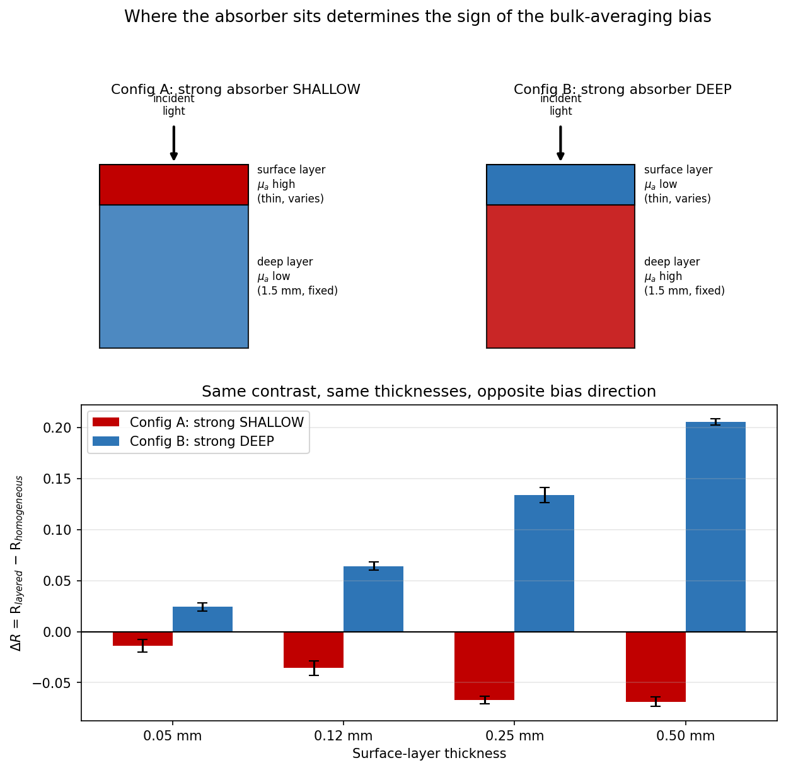
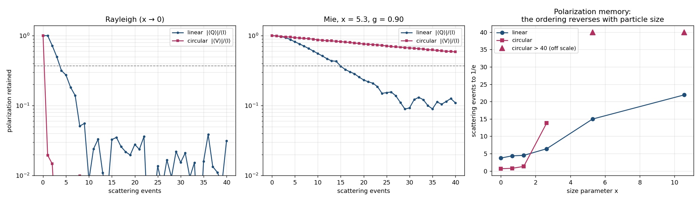

# photon-transport-toolkit

**A validated Monte Carlo model of light transport in turbid media — from a 2014 M.Sc. thesis to an independently cross-checked, polarization- and phase-resolved research engine.**

[](https://physiker80.github.io/photon-transport-toolkit/)
[](tests/)
[](matlab/)

This model addresses the same physics as my M.Sc. thesis, *"Simulation of
scattering processes in turbid media with ZEMAX and experimental
verification"* (Hochschule Aalen, 2014) — reimplemented here as an
independent, open, stochastic model rather than a ray-tracing build, so the
two approaches can be cross-checked against each other. All parameters in
the examples are generic textbook or catalogue values; nothing here
reproduces a commercial instrument.

📄 **[PROJECT_REPORT.md](PROJECT_REPORT.md)** is the full account — methodology, every result, every validation step, and the complete story behind the JAX backend, including a first attempt that turned out to be four times slower. This README is the short version.

🌐 Two interactive demo pages, same underlying engine: [**index**](https://physiker80.github.io/photon-transport-toolkit/) (short) and [**index_1**](https://physiker80.github.io/photon-transport-toolkit/index_1.html) (narrative walkthrough).

---

## The central finding

Which layer carries a fixed absorption contrast — holding total thickness and the bulk-average optical properties fixed — **flips the sign of the reflectance bias** between a layered medium and its homogeneous equivalent. Confirmed in 4/4 tested thicknesses, up to **70σ** in the Python engine and **47.7σ** in an independent MATLAB/Octave re-derivation, inside the physiological range for real skin.



That a single-layer fit to layered tissue produces regime-dependent error is itself established: Hennessy, Markey & Tunnell (*J. Biomed. Opt.* 2015) show it in fitted hemoglobin, melanin, and oxygen-saturation estimates, and Jones, Reitzle & Kienle (*Biomed. Opt. Express* 2025) in μₐ–μₛ′ cross-talk — both via inverse fitting. What's isolated here is narrower and sits underneath both: the sign of the raw forward-model reflectance bias itself, under a controlled swap of absorber placement with the bulk average and both absorption values held exactly fixed, before any fitting is involved. See PROJECT_REPORT §8 and §15 for the full positioning against this prior work.

This holds up under a specific, quantified caveat: at N=150 the same measurement is 0.48σ — statistically indistinguishable from noise. At N=150,000 it's 16.4σ. Every number in this project is reported with an uncertainty for exactly that reason.

---

## Install and run

```bash
git clone https://github.com/Physiker80/photon-transport-toolkit.git
cd photon-transport-toolkit
pip install -r requirements.txt

pytest tests/ -v                        # 110 tests (97 without the optional jax package)
python validation/validation_report.py  # quantitative comparison against known limits
```

Requires Python ≥ 3.10, NumPy, and Matplotlib. Every result reproduces exactly from a fixed seed.

```python
from photon_transport_toolkit import SlabOpticalProperties, simulate_slab

slab = SlabOpticalProperties(mu_a=0.02, mu_s=8.0, g=0.85, thickness=5.0)
result = simulate_slab(slab, n_photons=100_000, seed=0)

result.diffuse_reflectance   # with .diffuse_reflectance_stderr
result.transmittance         # with .transmittance_stderr
result.energy_balance        # 1.0 by construction
```

---

## What's inside

| Module | What it does | Full account |
|---|---|---|
| `monte_carlo` | Weighted-photon transport, homogeneous slab, Fresnel boundaries, Henyey-Greenstein scattering | PROJECT_REPORT §1 |
| `layered_media` | Same physics, arbitrary layer stacks — where the central finding lives | PROJECT_REPORT §6–8 |
| `tissue_optics` | Cited spectral parameterization for skin (melanin absorption, reduced scattering) | PROJECT_REPORT §9 |
| `coherent_transport` | Phase-resolved: complex speckle fields, imaging-system PSF convolution | PROJECT_REPORT §12 |
| `vector_transport` | Polarization **and** phase together: independent Jones and Stokes–Mueller tracers | PROJECT_REPORT §13 |
| `mie` | Mie scattering off spheres — amplitude matrix, efficiencies, bounded-rejection sampler | PROJECT_REPORT §13.8 |
| `vector_transport_jax` | Optional JAX batch backend (Rayleigh only), recommended above ~150,000 photons | PROJECT_REPORT §14 |

Every module was implemented from first principles and validated against an analytically known limit, an independent re-derivation, or both — never against a stored regression value.

---

## Three results beyond the central finding

**Polarization memory** (Mie scattering, §13.8–13.10): under Rayleigh scattering, linear polarization survives multiple scattering roughly 6× longer than circular. For particles comparable to the wavelength, that ordering **reverses**. This is established physics, not a new finding — known since the late 1980s and revisited as recently as *Laser & Photonics Reviews* (2025) — reproduced here as a from-scratch, independently cross-validated demonstration (Mie series checked against `miepython` to 9–10 significant figures), with one genuine methodological addition: three plausible ways of measuring "retained polarization" were tried and rejected before finding one that doesn't silently hide the effect (§13.9).



**Depolarization sets a speckle-contrast floor** (§13.5): a phase-only model of laser speckle contrast imaging predicts contrast = 1.0 regardless of medium. The combined phase-and-polarization engine shows the real floor is 0.68–0.75, purely from depolarization. This follows directly from Goodman's textbook partially-polarized-speckle formula and is already folded into laser speckle contrast imaging's standard instrumentation model — the addition here is an explicit, computed (not assumed) finite-sample correction to the asymptotic prediction.

**A decade-old thesis claim, re-tested** (§4): the Schlick phase-function approximation, used in the author's own 2014 thesis as "similar to Henyey-Greenstein but faster," holds at moderate anisotropy but diverges up to 37σ near tissue-relevant g ≈ 0.85–0.9. The speed claim holds (1.10–1.15× faster). Not checked against prior quantitative Schlick-vs-Henyey-Greenstein comparisons in the literature — the only one of these three not yet run through a literature check.

---

## Validation

Checked against regimes where the answer is known independently of the simulation — Beer-Lambert limit, exact energy conservation, conservative-scattering limit, forward-scattering limit — and, separately, against a from-scratch MATLAB/Octave re-derivation that caught two real bugs during development. Full tables and the validation philosophy are in PROJECT_REPORT §5 and §11.

**Not yet done:** benchmarking against the tabulated multiple-scattering solutions of van de Hulst (1980) — the standard quantitative comparison for codes of this type. Current tests constrain the limiting behavior, not the full diffusive regime.

---

## Related work

[**grating-spectrometer-model**](https://github.com/Physiker80/grating-spectrometer-model) — a Czerny-Turner grating monochromator model, split out of this repository once it grew large enough that bundling an unrelated instrument model made both harder to follow. Same author, same thesis origin, same validation discipline; the grating model answers the instrument-design question this project's planned experimental-validation phase depends on.

---

## References

1. L. Wang, S. L. Jacques, L. Zheng, "MCML — Monte Carlo modeling of light transport in multi-layered tissues," *Comput. Methods Programs Biomed.* **47**, 131–146 (1995).
2. L. G. Henyey, J. L. Greenstein, "Diffuse radiation in the galaxy," *Astrophys. J.* **93**, 70–83 (1941).
3. C. F. Bohren, D. R. Huffman, *Absorption and Scattering of Light by Small Particles*, Wiley (1983).
4. J. W. Goodman, *Speckle Phenomena in Optics*, Roberts & Company (2007).
5. H. C. van de Hulst, *Multiple Light Scattering: Tables, Formulas and Applications*, Academic Press (1980).

Full reference list, including per-section citations, in PROJECT_REPORT.md.

---

## Citation, author, license

Citation metadata: [`CITATION.cff`](CITATION.cff) (GitHub renders a ready-made citation from it).

**Noureddin Sedki**, M.Sc. Photonics (Hochschule Aalen, 2014). Background in optical system simulation (Zemax, COMSOL), optical coordinate metrology, and quality assurance in optical and electronic manufacturing.

Developed with AI-assisted implementation and documentation; the physics, validation design, and review of every result were done by the author.

MIT license — see [`LICENSE`](LICENSE).
